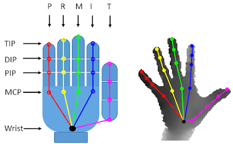
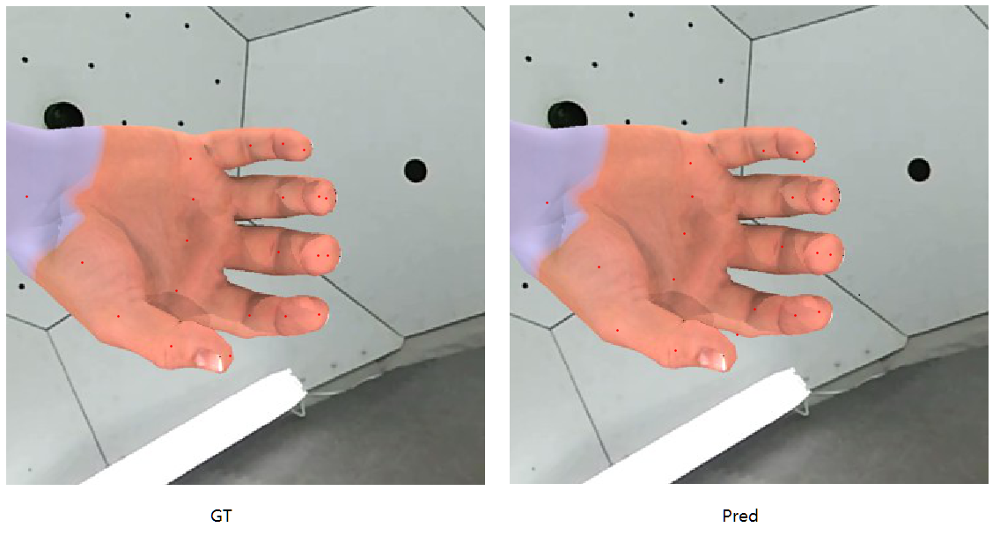
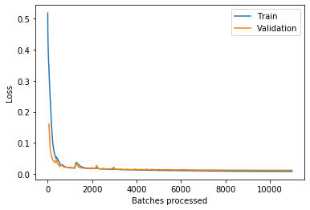

# Hand-Keypoint-Estimation

## Introduction



手部21点关键点识别



## TODO

- [x] ResNet34+Finetune
- [x] SqueezeNet+Finetune
- [ ] Hourglass
- [ ] Openpose+Design Loss
- [ ] 更好的效果展示
- [ ] 抗遮挡

## Dataset

[CMU手部数据集](http://domedb.perception.cs.cmu.edu/handdb.html)（遮挡比较变态）

```
Hands from Synthetic Data (6546 + 3243 + 2348 + 2124 = 14261 annotations)
└─hand_labels_synth
    ├─output_viz_synth
    ├─synth1（json文件数据缺失指尖5个关键点）
    ├─synth2
    ├─synth3
    └─synth4
```

## Benchmarking

**SqueezeNet+Finetune**

```
Finetune = nn.Sequential(
    Flatten(), 
    nn.ReLU(),
    nn.Dropout(0.5),
    nn.Linear(247808, 256),
    nn.ReLU(),
    nn.BatchNorm1d(256),
    nn.Dropout(0.5),
    nn.Linear(256, 42),
    Reshape(-1,21,2),
    nn.Tanh()
    ) 
Total params: 64,172,906
Total trainable params: 64,172,906
Total non-trainable params: 0
Loss function : MSELoss
Epoch : 200
LR : 0.01->0.0001
Train Loss end : 0.010500	
Valid Loss end : 0.012454
```



CPU上0.0234s一张图片

GPU-2070Ti上0.00727s一张图片